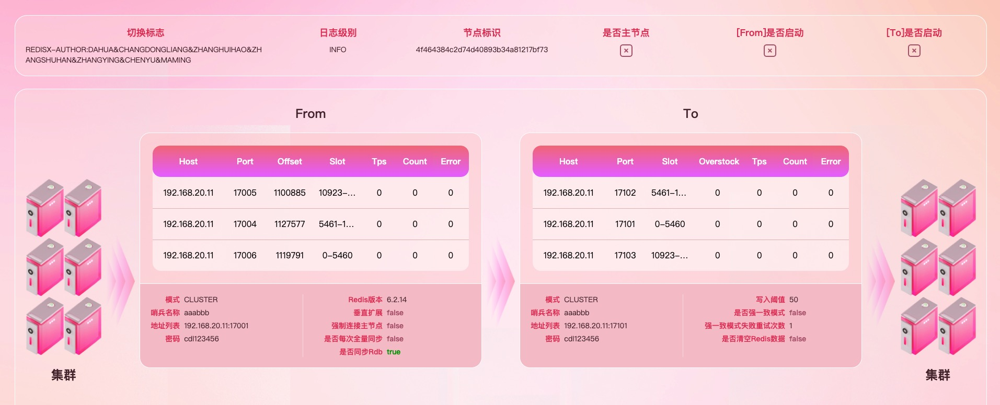

## Redis流复制工具Redisx

[](https://996.icu)

[English](https://github.com/970263611/redisx/blob/main/README.md) | 中文

### Redisx介绍

Redisx支持From端单机/哨兵/集群模式，To端单机/哨兵/集群模式自由组合。

- 支持Redis版本2.8及以上
- 支持高可用集群部署，垂直扩展
- 支持全量同步rdb数据，增量同步数据
- 支持支持续传
- 支持Redis的五种基本类型 + stream
- 支持From、To双端数据查询，宕机重连
- 支持定时退出一次性同步


CPU为13600KF、内存为DDR5 64G（32G双通道）的电脑上搭建3主3从两套redis集群，发压工具（30并发）和Redisx同时运行，在redisx没有特殊指定启动内存大小、没有-server启动、jdk为1.8的形况下，测试结果如下：


### 作者

大花团队（详见github提交者），redis相关材料请关注[material项目](https://github.com/970263611/redisx-material)

### 名词解释

Redisx:  流复制工具的名称

From：数据来源Redis端节点的统称

To：数据存入Redis端节点的统称

### 启动环境

环境需求为Jdk1.8+

### 快速启动

- 指定配置文件方式

  ```shell
  java -jar redisx.jar redisx.yml
  ```

- 使用默认配置文件方式

  ```shell
  java -jar redisx.jar
  ```

redisx.yml快速启动配置示例

```yaml
redisx:
  from:
    redis:
      version: 6.0.9  #redis版本
    password: 1a.2b*  #Redis密码
    mode: cluster     #Redis模式，单机：single 哨兵:sentinel 集群：cluster
    address:          #from数据来源地址，如模式是集群或哨兵，配置单一节点即可
      - 127.0.0.1:6379
  to:
    password: 1a.2b*  #redis密码
    mode: cluster     #Redis模式，单机：single 哨兵:sentinel 集群：cluster
    address:          #to数据来源地址，如模式是集群或哨兵，配置单一节点即可
      - 127.0.0.1:6380
```

Redisx启动时支持环境变量方式传递参数，此方式优先级高于配置文件方式。

```shell
-Dredisx.from.password=1a.2b* -Dredisx.to.password=2b*1a.
```

### 高可用

Redisx支持多节点主备部署，当多节点同时启动在切换标志（redisx.switchFlag）配置相同时会自动形成一主多从主备模式，当主节点发生异常时，备节点会自动升主，继续进行数据同步工作，并可断点续传，保证数据的完整性和连续性。此时异常节点恢复后会自动降从。

#### 垂直扩展

在From端为Redis集群模式同时存在大量数据时，一个Redisx节点进行全量的数据同步可能会存在延迟，所以Redisx支持拆分同步，可以通过配置使Redisx服务针对性同步某一些From集群节点，通过多次启动不同的Redisx节点来覆盖同步到所有的From集群节点，大幅度提高同步效率。


#### 自我修复

Redis节点的状态不会影响到Redisx服务的运行。当Redis节点出现服务宕机或者主节点漂移等异常现象时，Redisx可以自动判断选择正常的节点，并开始/终止数据同步工作，无需关心From/To端Redis节点的状态会对Redisx造成影响。

### 数据写入模式

##### 默认模式

默认采用一秒一次的频率提交偏移量，50条/100毫秒频率提交数据至To端集群，此模式吞吐量较高，和强一致模式互斥。

##### 强一致模式

强一致模式每条数据写入To集群后都会强制同步一次偏移量，此模式稳定性较高，和默认模式互斥。

##### 强制全量同步数据模式

强制全量同步数据模式为每次启动都会强制全量同步主/从所有数据信息，大数据量下初始会存在小延迟，但是可以保证数据幂等性，此模式不与其他模式互斥。

### 服务监控

通过Redisx页面监控功能可以实时展示Redis以及Redisx节点的工作状态，Redisx的数据同步速度，数据堆积以及Redisx的配置信息。同时现正在逐渐完善Redisx的告警功能。



##### 数据查询能力

注：不建议生产启动，不建议端口开放访问

```shell
http://${ip}:${port}/console?command=${command}&type=from/to   
#command为具体指令,type:为from查询from端redis数据，为to查询to端redis数据
如：
http://localhost:9999/console?command=get testKey&type=from
http://localhost:9999/console?command=get testKey&type=to
```

### 配置信息

#### 全量配置

```yaml
redisx:
  from:
    redis:
      #(必填项)from端redis版本，建议该版本不高于to端版本，防止因redis指令不兼容导致的同步问题
      version: 6.0.9
    #From端redis认证用户名
    username: fromUser
    #From端redis密码。哨兵模式下数据节点和哨兵节点密码应保持一致
    password: 1a.2b*
    #(必填项)from端redis模式，单机：single 哨兵:sentinel 集群：cluster
    mode: cluster
    #(redis.from.mode为sentinel时必填)哨兵模式下主节点的mastername
    masterName: myMaster
    #(必填项)from端redis节点地址，可配置单个或多个节点地址
    address:
      - 127.0.0.1:16001
    #是否开启垂直扩展，默认值false
    verticalScaling: false
    #是否强制连接主节点，默认值false
    connectMaster: false
  to:
    #To端redis认证用户名
    username: toUser
    #To端redis密码
    password: 2b*1a.
    #(必填项)to端redis模式，单机：single 哨兵:sentinel 集群：cluster
    mode: cluster
    #(redis.to.mode为sentinel时必填)哨兵模式下主节点的mastername
    masterName: myMaster
    #(必填项)to端redis节点地址，可配置单个或多个节点地址
    address:
      - 127.0.0.2:16101
    #是否在启动时清空to端数据（当redisx.from.alwaysFullSync为true时，此配置每次同步时都会生效），默认值false
    flushDb: false
    #to端单次写入数据阈值，默认值50
    flushSize: 50
  console:
    #是否启用控制台，默认值true
    enable: true
    #是否开启控制台双向查询数据功能，默认值false
    search: false
    #控制台响应超时时间（毫秒），默认值5000
    timeout: 5000
    #控制台发布端口，默认值15967
    port: 15967
  #强一致模式，该模式下，单条数据完成io才会进行偏移量更新
  #开启后可以降低服务异常导致的数据不一致问题，但会大幅度降低同步效率
  immediate:
    #是否开启强一致模式，默认值false
    enable: false
    #强一致模式下写入失败重试次数，默认值1
    resendTimes: 1
  #全局是否强制全量同步数据模式
  #开启后每次重新开始同步均会进行全量同步，而不进行续传同步
  #开启后，syncRdb配置强制为true
  #默认值false
  alwaysFullSync: false
  #redisx主从切换标志
  switchFlag: REDISX-AUTHOR:DAHUA&CHANGDONGLIANG&ZHANGHUIHAO&ZHANGSHUHAN&ZHANGYING&CHENYU&MAMING
  #是否同步存量数据，默认值true
  syncRdb: true
  #定时退出
  timedExit:
    #是否开启定时退出，默认值false
    enable: false
    #是否不执行关闭钩子函数
    #在[timedExit.enable=true]时生效，默认值false
    force: false
    #定时时长，单位：秒，小于0且未开启只同步rdb功能时，则定时退出功能失效
    #在[timedExit.enable=true]时生效，默认值-1
    duration: -1
    #只同步rdb，当定时和此配置同时设置时，两个同时生效，当一方触发则程序退出
    #此配置生效时[timedExit.force]配置强制为false
    #在[timedExit.enable=true]时生效，默认值false
    onlyRdb: false
#配置文件支持enc加密，加密的配置需要使用'ENC(配置内容)'包裹
jasypt:
  encryptor:
    password: KU1aBcAit9x
    algorithm: PBEWithMD5AndDES
    ivGeneratorClassName: org.jasypt.iv.NoIvGenerator
logging:
  level:
    #全局日志级别
    global: info
```

#### 场景推荐配置

以下数据差异描述中的数据量差异指数据存在key不一致（From多To少），value不一致（List数据内容重复）问题

##### 数据强一致同步场景

```yaml
redisx:
  from:
    redis:
      version: x.x.x
    mode: cluster
    password: 1a.2b*
    address:
      - xxx.xxx.xxx.xxx:port
      ...
    alwaysFullSync: true
  to:
    mode: cluster
    password: 1a.2b*
    address:
      - xxx.xxx.xxx.xxx:port
      ...
    flushDb: true #当redisx.from.alwaysFullSync为true时，此配置每次同步时都会生效
```

功能描述

1、数据强一致，严格要求From和To端数据完全一致

2、From端优先选从节点连接，无从选主

3、不再中断续传，每次均进行全量同步

无数据差异

**注**：此模式会在每一次异常场景都会清空To端数据后重新同步From端数据，To端可能存在短时间数据不一致，且全量数据同步需要带宽资源。To端存在独有key则无法使用此模式，灾备切换时停止From端后也需要停止Redisx服务

##### 大数据量数据同步场景

```yaml
redisx:
  from:
    redis:
      version: x.x.x
    mode: cluster
    password: 1a.2b*
    address:
      - xxx.xxx.xxx.xxx:port
      ...
  to:
    mode: cluster
    password: 1a.2b*
    address:
      - xxx.xxx.xxx.xxx:port
      ...
```

功能描述

1、高效同步，批量提交，单个To节点每50条数据或间隔最大100毫秒进行一次数据提交和偏移量刷新

2、From端优先选从节点连接，无从选主

3、Redis服务异常时中断同步，Redis服务正常时自动开始同步

4、支持存量RDB数据同步，支持中断续传

数据差异描述（仅异常情况下才可能产生）

1、From端任意节点故障或Redisx正常关闭(kill)，无数据差异

2、单次To端主节点故障，可能出现不大于To数量与redisx.to.flushSize之积的数据差异

3、Redisx通过强制中断(kill -9)，可能出现不大于To端主节点个数与redisx.to.flushSize之积的数据差异

##### 数据量较小，但对一致性要求较高

```yaml
redisx:
  from:
    redis:
      version: x.x.x
    mode: cluster
    password: 1a.2b*
    address:
      - xxx.xxx.xxx.xxx:port
      ...
  to:
    mode: cluster
    password: 1a.2b*
    address:
      - xxx.xxx.xxx.xxx:port
      ...
  immediate:
    enable: true
```

功能描述

1、效率较低，单条提交，单个To节点每1条数据进行一次数据提交及I/O操作结果确认，偏移量刷新及结果确认

2、From端优先选从节点连接，无从选主

3、Redis服务异常时中断同步，Redis服务正常时自动开始同步

4、支持存量RDB数据同步，支持中断续传

数据差异描述（仅异常情况下才可能产生）

1、From端任意节点故障或Redisx正常关闭(kill)，无数据差异

2、单次To端主节点故障，可能出现不大于To端Redis主节点个数的数据量差异

3、Redisx通过强制中断(kill -9)，可能出现不大于To端Redis主节点个数的数据量差异

##### 集群模式，数据量极大，对同步效率要求极高

组：指redisx.switchFlag配置相同的节点集合

Redisx组1：

```yaml
redisx:
  from:
    redis:
      version: x.x.x
    mode: cluster
    password: 1a.2b*
    address:
      - From节点1
      ...
    verticalScaling: true
  to:
    mode: cluster
    password: 1a.2b*
    address:
      - xxx.xxx.xxx.xxx:port
      ...
  switchFlag: REDISX-...每组Redisx服务必须不一致，同组主备Redisx服务须一致
```

Redisx组2:

```yaml
redisx:
  from:
    redis:
      version: x.x.x
    mode: cluster
    password: 1a.2b*
    address:
      - From节点2
      ...
    verticalScaling: true
  to:
    mode: cluster
    password: 1a.2b*
    address:
      - xxx.xxx.xxx.xxx:port
      ...
  switchFlag: REDISX-...每组Redisx服务必须不一致，同组主备Redisx服务须一致
```

功能描述

1、仅对配置中的From节点数据进行同步，不扩展至整个From集群数据

2、From端仅选择配置节点

3、Redis服务异常时中断同步，Redis服务正常时自动开始同步

4、支持存量RDB数据同步，支持中断续传

数据差异描述（仅异常情况下才可能产生）

1、From端任意节点故障或Redisx正常关闭(kill)，无数据差异

2、单次To端主节点故障，可能出现不大于To端Redis主节点个数的数据量差异

3、Redisx通过强制中断(kill -9)，可能出现不大于To端Redis主节点个数的数据量差异

##### 一次性同步/定时同步

```yaml
redisx:
  from:
    redis:
      version: x.x.x
    mode: cluster
    password: 1a.2b*
    address:
      - xxx.xxx.xxx.xxx:port
      ...
  to:
    mode: cluster
    password: 1a.2b*
    address:
      - xxx.xxx.xxx.xxx:port
      ...
  timedExit:
    enable: true
    force: true  #是否开启中断补偿，及中断时队列中的堆积数据是否完全同步；默认false
    duration: 1000   #多久关闭，单位秒
```

功能描述

1、同步效率同常规模式或强一致模式，运行设定时长后，自动关闭

2、From端优先选从节点连接，无从选主

3、Redis服务异常时中断同步，Redis服务正常时自动开始同步

4、支持存量RDB数据同步

无数据差异

#### 其它配置

##### 配置加密

功能描述

密码加密，支持jasypt密码加解密操作，加密配置放入ENC(...)括号中

配置信息

```yaml
redisx:
  from:
    password: ENC(...)
jasypt:
  encryptor:
    password: U8eT6mld1
    algorithm: PBEWithMD5AndDES
    ivGeneratorClassName: org.jasypt.iv.NoIvGenerator
```

##### To端数据清理

功能描述

全局首次启动时清理To端数据，适用于To端脏数据清理

配置信息

```yaml
redisx:
  to:
    flushDb: true #默认false
```

##### 每次全量同步

功能描述

不再中断续传，每次均进行全量同步。数据完整性强，适用要求数据完整的场景

配置信息

```yaml
redisx:
  alwaysFullSync: true #默认false
```

##### 仅增量同步

功能描述

不再同步存量RDB数据，仅同步Redisx服务启动后产生的增量数据；若开启仅全量同步，该配置失效。

配置信息

```yaml
redisx:
  syncRdb: false #默认true
```

[](https://github.com/996icu/996.ICU/blob/master/LICENSE)