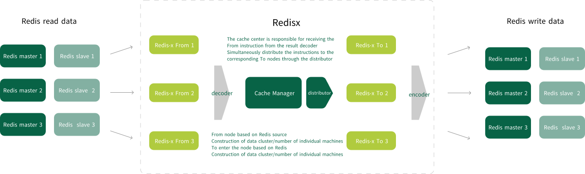
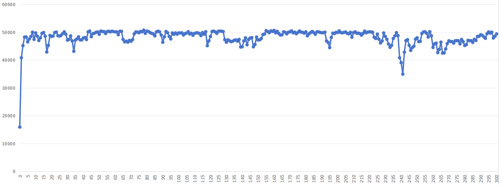
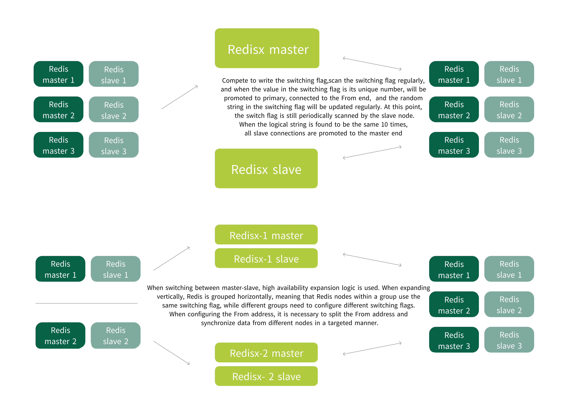
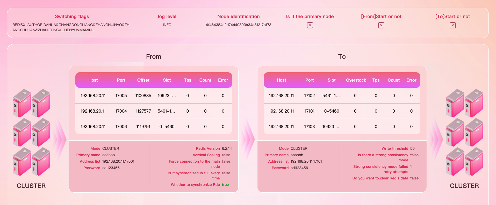

## Redis stream replication tool Redisx

[](https://996.icu) 

English | [中文](https://github.com/970263611/redisx/blob/main/README-CN.md)

### Introduction to Redisx

Redis supports the From side single machine/sentinel'cluster mode, and the To sidesingle machine sentinel cluster mode can be freely combined。

- Supports Redis version2.8 and above
- Support high availability cluster deployment and vertical scaling
- Support full synchronization of RDB data and incremental synchronization of data
- Support for continued transmission
- Supports the five basic types of Redis + stream
- Support From and To dual end data queries, with the ability to reconnect in case of downtime
- Support timed exit for one-time synchronization



On a computer with a CPU of 13600KF and DDR5 64G memory (32G dual channel), 3 hosts and 3 slaves were set up in two Redis clusters. The boosting tool (30 concurrent) and Redis were run simultaneously. In the absence of a specific boot memory size, no server startup, and a JDK of 1.8 in Redis, the test results are as follows:

​                                             **Test the data transmission rate of Redisx**



### Author

Dahua team (see GitHub submitter for details),please pay attention to [material project](https://github.com/970263611/redisx-material) for Redis related materials.

### Definition

Redisx:The name of the stream replication tool.

From:The collective name of Redis end nodes for data sources.

To:The collective name of Redis end nodes for data storage.

### The startup environment 

Jdk1.8+

### Quick start

- Specify the configuration file method

  ```shell
  java -jar redisx.jar redisx.yml
  ```

- Use default configuration file method

  ```shell
  java -jar redisx.jar
  ```

redisx.yml Quick Start Configuration Example

```yaml
redisx:
  from:
    redis:
      version: 6.0.9  #Redis version
    password: 1a.2b*  #Redis password
    mode: cluster     #Redis mode,single sentinel cluster
    address:          #From Data source address, such as cluster or sentinel mode, can be configured with a single node
      - 127.0.0.1:6379
  to:
    password: 1a.2b*  #Redis password
    mode: cluster     #Redis mode,single sentinel cluster
    address:          #To Data source address, such as cluster or sentinel mode, can be configured with a single node
      - 127.0.0.1:6380
```

Redisx At startup, it supports passing parameters in the environment variable mode, which has higher priority than the configuration file mode

```shell
-Dredisx.from.password=1a.2b* -Dredisx.to.password=2b*1a.
```

### Availability

Redisx supports multi node primary and backup deployment.When multiple nodes start simultaneously and the switch flag (redisx. switchFlag)configuration is the same, it will automatically form a one master, multi slave primaryand backup mode. When the primary node is abnormal, the backup node willautomatically become the primary node, continue data synchronization work. and canresume transmission with breakpoints to ensure data integrity and continuity. At thispoint, the abnormal node will automatically downgrade after recovery.

#### Vertical Scaling

When there is a large amount of data in Redis cluster mode on the From side duringvertical expansion, there may be a delay in synchronizing the entire amount of datawith a Redis node. Therefore, Redis supports split synchronization, which can beconfigured to enable the Redis service to selectively synchronize certain From clusternodes. By starting different Redis nodes multiple times, synchronization can becovered to all From cluster nodes, greatly improving synchronization efficiency.



#### Self-healing


The status of Redis nodes will not affect the operation of Redisx services. When Redis nodes experience abnormal phenomena such as service downtime or master node drift, Redis can automatically select normal nodes and start/stop data synchronization work without worrying about the status of Redis nodes on the From/To side, which may affect Redis.

### Data writing mode

##### Default Mode

The default mode is to submit offset data at a frequency of once per second, with 50 data per 100milliseconds submitted to the To cluster. This mode has a high throughput and ismutually exclusive with the Strong Consistency mode.

##### Strong consistency mode

 After each data 1s written to the To cluster, it is forciblysynchronized with an offset. This mode has high stability and is mutually exclusivewith the default mode.

##### The forced full synchronization data mode

The forced full synchronization data mode forces full synchronization of all data information from the master/slave every time it is started. There may be a small initial delay in large data volumes, but data idempotency can be guaranteed. This mode is not mutually exclusive with other modes.

### Service Monitoring

The Redisx page monitoring function can display the real-time working status of Redis and Redisx nodes, Redisx's data synchronization speed, data accumulation, and configuration information. At the same time, we are gradually improving the alarm function of Redisx.



##### Data query capability

**Note **:Production startup is not recommended, and port access is not recommended

```shell
http://${ip}:${port}/console?command=${command}&type=from/to   
#'command' is a specific instruction, 'type' is To query Redis data From the source, and To query Redis data From the source
For example：
http://localhost:9999/console?command=get testKey&type=from
http://localhost:9999/console?command=get testKey&type=to
```

### Configuration information

#### Full configuration

```yaml
redisx:
  from:
    redis:
      #(Required field) From Redis version, it is recommended that this version should not be higher than the to version to prevent synchronization issues caused by Redis instruction incompatibility
      version: 6.0.9
    #Redis password From the end.The passwords for data nodes and sentinel nodes should be consistent in sentinel mode.
    password: 1a.2b*
    #(Required field)From Redis mode, single sentinel cluster
    mode: cluster
    #(redis.from.mode is mandatory when sent as sentinel)mastername of the master node in sentinel mode
    masterName: myMaster
    #(Required field)From Redis node address, configurable for single or multiple node addresses
    address:
      - 127.0.0.1:16001
    #Whether to enable vertical expansion, default value is false
    verticalScaling: false
    #Whether to force connection to the main node, default value is false
    connectMaster: false
  to:
    #To end Redis password
    password: 2b*1a.
    #(Required field)To Redis mode, single sentinel cluster
    mode: cluster
    #(Required when redis.to.mode is sentinel) mastername of the master node in sentinel mode
    masterName: myMaster
    #(Required field)To end Redis node address, configurable for single or multiple node addresses
    address:
      - 127.0.0.2:16101
    #Whether to clear the data on the To end at startup (this configuration will take effect every time redisx.for.alwaysFullSync is true), default value is false
    flushDb: false
    #To end single write data threshold, default value is 50
    flushSize: 50
  console:
    #Whether to enable console, default value is true
    enable: true
    #Whether to enable bidirectional data query function on the console, default value is false
    search: false
    #Console response timeout (milliseconds), default value 5000
    timeout: 5000
    #Console publishing port, default value 15967
    port: 15967
  #Strong consistency mode, in which a single piece of data will only undergo offset updates after completing IO
  #Enabling it can reduce data inconsistency caused by service exceptions, but it will significantly decrease synchronization efficiency
  immediate:
    #Whether to enable strong consistency mode, default value is false
    enable: false
    #Write failure retry times in strong consistency mode, default value 1
    resendTimes: 1
  #Is the global mandatory full synchronization data mode
  #After activation, full synchronization will be performed every time synchronization is restarted, without continuing synchronization
  #After activation, syncRdb configuration is forced to true
  #Default value false
  alwaysFullSync: false
  #Redisx master-slave switching flag
  switchFlag: REDISX-AUTHOR:DAHUA&CHANGDONGLIANG&ZHANGHUIHAO&ZHANGSHUHAN&ZHANGYING&CHENYU&MAMING
  #Whether to synchronize stock data, default value is true
  syncRdb: true
  #Timed exit
  timedExit:
    #Whether to enable timed exit, default value is false
    enable: false
    #Do not execute the close hook function
    #Effective at [timedExit. enable=true], default value is false
    force: false
    #Timing duration, unit: seconds. If it is less than 0 and the only synchronized rdb function is not enabled, the timed exit function will be invalid
    #Effective at [timedExit. enable=true], default value -1
    duration: -1
    #Only synchronize rdb. When [enable=true] and this configuration are set simultaneously, both will take effect simultaneously. When one of them triggers, the program will exit
    #When this configuration takes effect, the [timedExit. force] configuration is forced to false
    #Effective at [timedExit. enable=true], default value is false
    onlyRdb: false
#The configuration file supports enc encryption, and the encrypted configuration requires the use of 'ENC (configuration content)' package
jasypt:
  encryptor:
    password: KU1aBcAit9x
    algorithm: PBEWithMD5AndDES
    ivGeneratorClassName: org.jasypt.iv.NoIvGenerator
logging:
  level:
    #Global log level
    global: info
```

#### Recommended scene configuration

The data volume difference in the following data difference description refers to the problem of inconsistent keys (more From, less To) and inconsistent values (duplicate List data content) in the data

##### Data Strong Consistent Synchronization Scenario

```yaml
redisx:
  from:
    redis:
      version: x.x.x
    mode: cluster
    password: 1a.2b*
    address:
      - xxx.xxx.xxx.xxx:port
      ...
    alwaysFullSync: true
  to:
    mode: cluster
    password: 1a.2b*
    address:
      - xxx.xxx.xxx.xxx:port
      ...
    flushDb: true #When redisx.for.alwaysFullSync is true, this configuration will take effect every time it synchronizes
```

Function Description

1.Strong consistency of data, strict requirement for From and To end data to be completely consistent

2.Priority is given to connecting From nodes on the From end, and there is no way to select the master

3.No longer interrupt the continuation, perform full synchronization every time

No data difference

**Note **:This mode will clear the To data and resynchronize the From data in every abnormal scenario. There may be short-term data inconsistency on the To side, and full data synchronization requires bandwidth resources. If there is a unique key on the To end, this mode cannot be used, and after stopping the From end during disaster recovery switching, the Redisx service also needs to be stopped

##### Scenario of synchronizing large amounts of data

```yaml
redisx:
  from:
    redis:
      version: x.x.x
    mode: cluster
    password: 1a.2b*
    address:
      - xxx.xxx.xxx.xxx:port
      ...
  to:
    mode: cluster
    password: 1a.2b*
    address:
      - xxx.xxx.xxx.xxx:port
      ...
```

Function Description

1.Efficient synchronization, batch submission, data submission and offset refresh for a single To node every 50 pieces of data or with a maximum interval of 100 milliseconds

2.Priority is given to connecting From nodes on the From end, and there is no way to select the master

3.Interrupt synchronization when Redis service is abnormal, and automatically start synchronization when Redis service is normal

4.Support synchronization of existing RDB data and support interruption and continuation of transmission

Data discrepancy description (may only occur in abnormal situations)

1.Any node on the From end fails or Redis is shut down normally (kill), with no data difference

2.A single To end master node failure may result in a data difference of no more than the product of the To quantity and redisx.to.flushSize

3.Redisx may experience a data difference of no more than the product of the number of To end master nodes and redisx.to.flushSize by forcing an interrupt (kill -9)

##### The data volume is small, but there is a high requirement for consistency

```yaml
redisx:
  from:
    redis:
      version: x.x.x
    mode: cluster
    password: 1a.2b*
    address:
      - xxx.xxx.xxx.xxx:port
      ...
  to:
    mode: cluster
    password: 1a.2b*
    address:
      - xxx.xxx.xxx.xxx:port
      ...
  immediate:
    enable: true
```

Function Description

1.Low efficiency, single submission, single To node performs data submission and I/O operation result confirmation for every 1 data, offset refresh and result confirmation

2.Priority is given to connecting From nodes on the From end, and there is no way to select the master

3.Interrupt synchronization when Redis service is abnormal, and automatically start synchronization when Redis service is normal

4.Support synchronization of existing RDB data and support interruption and continuation of transmission

Data discrepancy description (may only occur in abnormal situations)

1.Any node on the From end fails or Redis is shut down normally (kill), with no data difference

2.A single To end master node failure may result in a difference in data volume not exceeding the number of To end Redis master nodes

3.Redis may experience a data volume difference of no more than the number of Redis master nodes on the To side through forced interrupts (kill -9)

##### Cluster mode, with a huge amount of data, requires extremely high synchronization efficiency

Group: Refers to a collection of nodes with the same redisx.switchFlag configuration

Redisx Group1：

```yaml
redisx:
  from:
    redis:
      version: x.x.x
    mode: cluster
    password: 1a.2b*
    address:
      - From node1
      ...
    verticalScaling: true
  to:
    mode: cluster
    password: 1a.2b*
    address:
      - xxx.xxx.xxx.xxx:port
      ...
  switchFlag: REDISX-...Each group of Redisx services must be inconsistent, and the primary and backup Redisx services within the same group must be consistent
```

Redisx Group2:

```yaml
redisx:
  from:
    redis:
      version: x.x.x
    mode: cluster
    password: 1a.2b*
    address:
      - From node2
      ...
    verticalScaling: true
  to:
    mode: cluster
    password: 1a.2b*
    address:
      - xxx.xxx.xxx.xxx:port
      ...
  switchFlag: REDISX-...Each group of Redisx services must be inconsistent, and the primary and backup Redisx services within the same group must be consistent
```

Function Description

1.Only synchronize the From node data in the configuration, without extending to the entire From cluster data

2.Select only configuration nodes From the end

3.Interrupt synchronization when Redis service is abnormal, and automatically start synchronization when Redis service is normal

4.Support synchronization of existing RDB data and support interruption and continuation of transmission

Data discrepancy description (may only occur in abnormal situations)

1.Any node on the From end fails or Redis is shut down normally (kill), with no data difference

2.A single To end master node failure may result in a difference in data volume not exceeding the number of To end Redis master nodes

3.Redis may experience a data volume difference of no more than the number of Redis master nodes on the To side through forced interrupts (kill -9)

##### One time synchronization/Timed synchronization

```yaml
redisx:
  from:
    redis:
      version: x.x.x
    mode: cluster
    password: 1a.2b*
    address:
      - xxx.xxx.xxx.xxx:port
      ...
  to:
    mode: cluster
    password: 1a.2b*
    address:
      - xxx.xxx.xxx.xxx:port
      ...
  timedExit:
    enable: true
    force: true  #Whether to enable interrupt compensation and whether the accumulated data in the queue is fully synchronized during the interrupt;Default false
    duration: 1000   #How long does it close, in seconds
```

Function Description

1.The synchronization efficiency is the same as the regular mode or strong consistency mode, and it will automatically shut down after the set running time

2.Priority is given to connecting From nodes on the From end, and there is no way to select the master

3.Interrupt synchronization when Redis service is abnormal, and automatically start synchronization when Redis service is normal

4.Support synchronization of existing RDB data

No data difference

#### Other configurations

##### Configure encryption

Function Description

Password encryption, supports jasypt password encryption and decryption operations, encryption configuration is placed in ENC (...) parentheses

configuration information

```yaml
redisx:
  from:
    password: ENC(...)
jasypt:
  encryptor:
    password: U8eT6mld1
    algorithm: PBEWithMD5AndDES
    ivGeneratorClassName: org.jasypt.iv.NoIvGenerator
```

##### To end data cleaning

Function Description

Clean up To data during global initial startup, suitable for cleaning dirty data on the To side

configuration information

```yaml
redisx:
  to:
    flushDb: true #Default false
```

##### Every full synchronization

Function Description

No longer interrupt the continuation, perform full synchronization every time. Strong data integrity, suitable for scenarios that require complete data

configuration information

```yaml
redisx:
  alwaysFullSync: true #Default false
```

##### Incremental synchronization only

Function Description

No longer synchronizing existing RDB data, only synchronizing incremental data generated after the launch of the Redisx service; If only full synchronization is enabled, this configuration becomes invalid.

configuration information

```yaml
redisx:
  syncRdb: false #Default true
```

[](https://github.com/996icu/996.ICU/blob/master/LICENSE)
